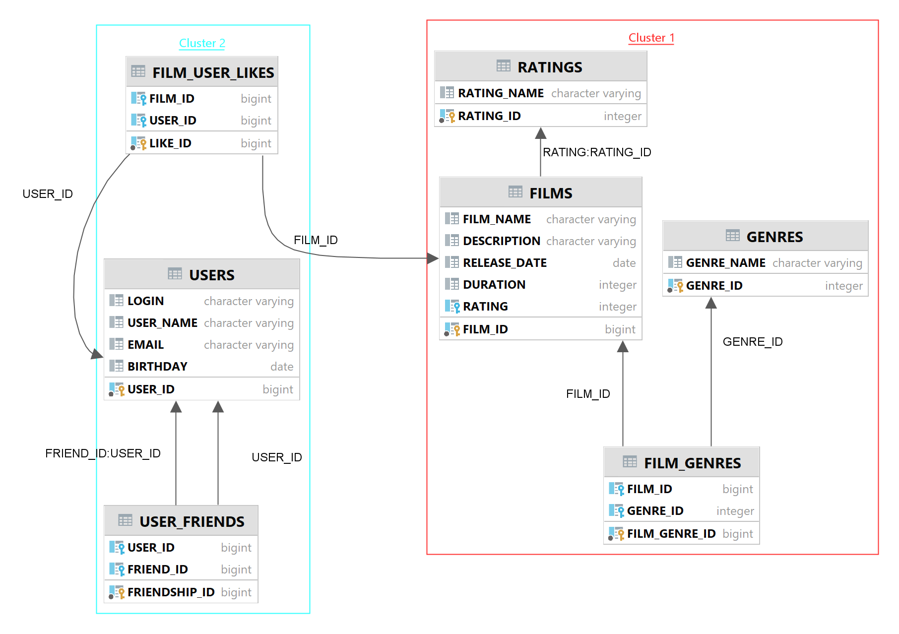

# java-filmorate
Template repository for Filmorate project.
Branched from main to develop as HEAD.

<b>Contents of database are the following:</b>
_____
1 - users -- SELECT * FROM users
-----
- user_id PK bigint
- login varchar 
- user_name varchar
- email varchar
- birthday date

2 - users_friends -- SELECT * FROM users_friends
-----
- friendship_id PK bigint
- user_id bigint FK >- users.user_id
- friend_id bigint FK >- users.user_id

3 - films_users_likes -- SELECT * FROM films_users_likes
-----
- like_id PK bigint
- film_id bigint FK >- films.film_id
- user_id bigint FK >- users.user_id

4 - films -- SELECT * FROM films
-----
- film_id PK bigint
- film_name varchar
- description varchar
- release_date date
- duration int
- rating int FK >- ratings.rating_id

5 - ratings -- SELECT * FROM ratings
-----
- rating_id PK int
- rating_name varchar

6 - genres -- SELECT * FROM genres
-----
- genre_id PK int
- genre_name varchar

7 - films_genres -- SELECT * FROM films_genres
-----
- film_genre_id PK bigint
- film_id PK bigint FK >- films.film_id
- genre_id int FK >- genres.genre_id

